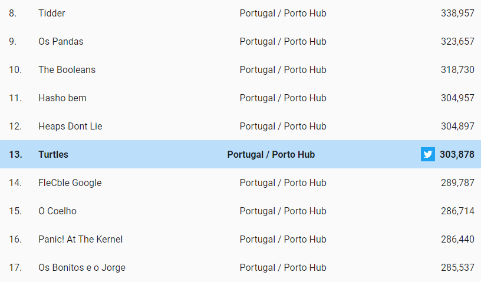
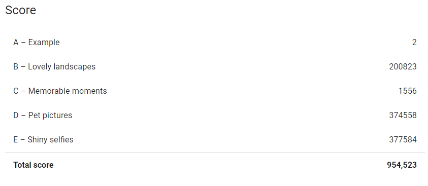
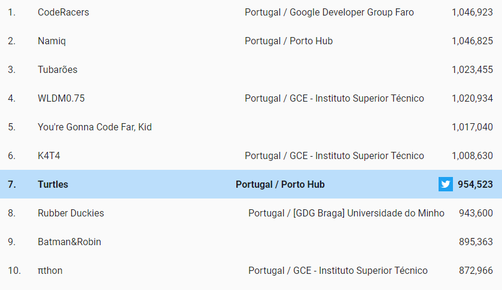

# Hash Code 2019
#️⃣ Hash Code is a team programming competition, organized by Google, for students and professionals around the world. 

## Authors

* **Diogo Samuel Fernandes** - [GitHub](https://github.com/SamuelKun)
* **Henrique Pereira** - [GitHub](https://github.com/GodAnri)
* **Teresa Corado** - [GitHub](https://github.com/Reesa23)

## Normal Round

## After Round

